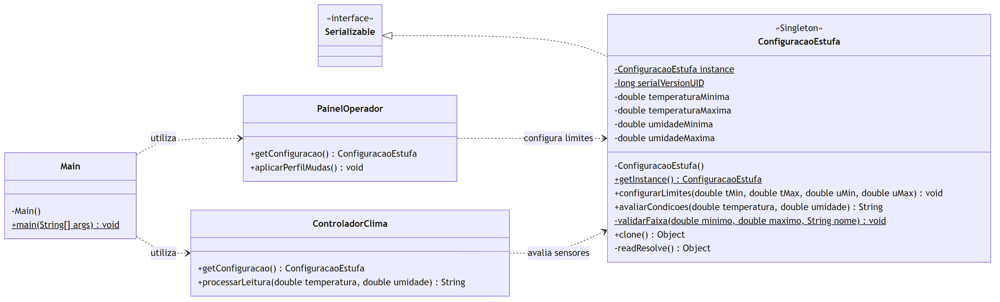

# Singleton — Configuração de uma estufa

Projeto acadêmico em Java 21 e Maven, escrito do zero para demonstrar o padrão GoF Singleton.

## Sobre o projeto

O Singleton mantém uma única instância de uma classe e permite que diferentes partes do sistema acessem esse mesmo objeto.

Neste projeto, ele guarda os limites de temperatura e umidade de uma estufa. O `PainelOperador` altera a configuração e o `ControladorClima` usa esses limites para avaliar as leituras dos sensores. Como os dois acessam a mesma instância, uma alteração feita no painel também é considerada pelo controlador.

Dependendo da leitura, o sistema recomenda aquecer, ventilar, irrigar ou reduzir a umidade. Os valores usados são exemplos para a simulação.

## Diagrama de classes



O arquivo editável está em [docs/class-diagram.mmd](docs/class-diagram.mmd).

## Como executar

É necessário ter JDK 21 e Maven 3.9 ou superior instalados. Na pasta do projeto, compile com:

```sh
mvn clean compile
```

Execute a demonstração:

```sh
java -cp target/classes singleton.estufa.Main
```

Saída:

```text
Mesma instância: true
Sensores: 19°C e 45% -> AQUECER | IRRIGAR
Sensores: 25°C e 60% -> TEMPERATURA_OK | UMIDADE_OK
```

## Testes

Para compilar e rodar todos os testes:

```sh
mvn clean test
```

Os 10 testes verificam a identidade da instância, o compartilhamento de estado, o acesso com 100 threads, os bloqueios de reflexão e clonagem, a serialização e as regras de temperatura e umidade.

Trecho do resultado obtido:

```text
Concorrência: 100 threads; instâncias distintas por identidade: 1
Identidade por ==: true
[INFO] Tests run: 10, Failures: 0, Errors: 0, Skipped: 0
[INFO] BUILD SUCCESS
```

## Estrutura de pastas

```text
padrao-singleton/
├── .gitignore                         # Arquivos ignorados pelo Git
├── pom.xml                            # Configuração do Maven
├── README.md
├── docs/
│   ├── class-diagram.mmd              # Diagrama em Mermaid
│   └── class-diagram.png              # Imagem do diagrama
└── src/
    ├── main/java/singleton/estufa/
    │   ├── ConfiguracaoEstufa.java    # Singleton e regras da estufa
    │   ├── PainelOperador.java        # Altera os limites
    │   ├── ControladorClima.java      # Avalia as leituras
    │   ├── ComparacaoSingleton.java   # Versões eager, lazy e enum
    │   └── Main.java                  # Demonstração
    └── test/java/singleton/estufa/
        ├── ConfiguracaoEstufaTest.java
        └── ConcorrenciaSingletonTest.java
```

## Decisões de projeto

- A instância é criada apenas no primeiro acesso. O double-checked locking com `volatile` evita duas criações concorrentes e garante que as threads recebam o objeto já inicializado.
- Os métodos de configuração e avaliação são sincronizados para evitar a leitura de limites parcialmente atualizados.
- O construtor é privado e rejeita tentativas de reflexão quando já existe uma instância. Essa proteção não cobre reflexão antes do primeiro acesso.
- A clonagem é bloqueada. Na desserialização, `readResolve()` retorna a instância existente, mantendo os limites atuais em vez de restaurar valores antigos. Em uma JVM nova, são usados os limites padrão.
- O teste de concorrência roda em uma JVM separada, com 100 threads liberadas por uma barreira para disputar a primeira criação.
- A classe de comparação mostra outras opções: eager cria a instância na inicialização da classe, lazy holder adia a criação e enum oferece proteção nativa contra reflexão comum e duplicação na desserialização.

## Críticas / quando NÃO usar Singleton

O Singleton introduz estado global e oculta dependências por meio de `getInstance()`. Isso pode dificultar a manutenção e os testes, pois uma alteração de estado pode afetar outras partes do sistema.

Ele faz sentido nesta simulação de uma estufa, mas não seria adequado para várias estufas com configurações diferentes. A instância também é única apenas por classloader, sem compartilhar estado entre processos. Nesses casos, configurações separadas e injeção de dependências seriam alternativas melhores.

---

Aluno: **Samir Gedeon Machado**  
Disciplina: **Arquitetura e Projeto de Software**  
Data: **10/09/2026**
